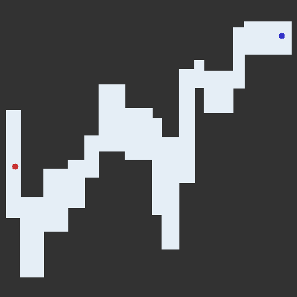

# ReinforcementLearning

## Reinforcement Learning coursework for MSc AI 

Implementing reinforcement learning for maze solving.
The maze is randomly generated each time and a Q-Learning agent is trained for 10 minutes to solve the task.

The following methods are implemented:

1) Deep Q network 
2) Dueling Q network
3) Target network
4) Double Q learning
5) Experience replay buffer
6) Prioritised action replay
7) Decaying epsilon greedy exploration

  

